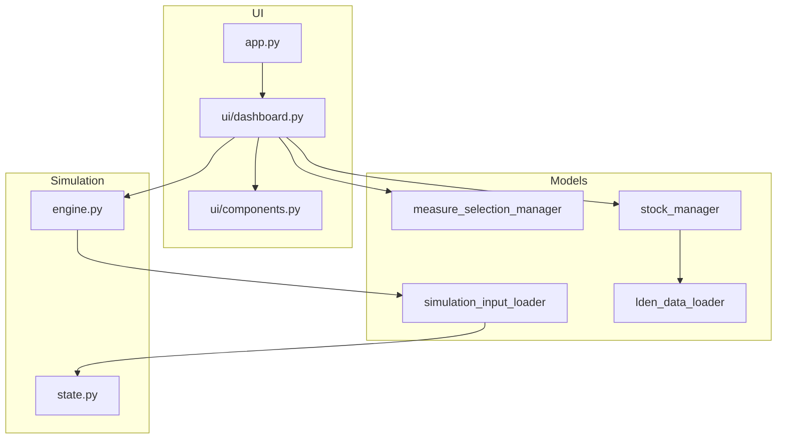

# Architectuur

Codekaart van het Balanced Approach-dashboard: modules, verantwoordelijkheden en het pad van UI-selectie naar simulatie.

[← Terug naar README](../readme.md)

---

## Lagen

| Map / bestand | Rol |
|---------------|-----|
| `app.py` | Entry: authenticatie + navigatie |
| `config.py` | Jaren, paden naar `input/`/`output/` |
| `models/` | Data laden, selectiestatus, scenario-presets, validatie, SimulationState-bouw |
| `simulation/` | Jaar-op-jaar engine en helpers |
| `ui/` | Dashboard, sidebar, grafieken, auth |
| `contour_analyse_1.py` / `_2.py` | Actieve datapipeline Lden → `input/` |
| `contour/` + notebooks | Legacy / parallel pad voor contour-export |
| `input/` | CSV-configuratie en analyse-exports |
| `output/` | Simulatieresultaten |
| `tests/` | Unit- en regressietests |

---

## Pad van een maatregel

1. **Sidebar** (`ui/components.render_sidebar_controls`) — zones A–F en/of overlay-checkboxes.
2. **MeasureSelectionManager** — `get_selected_zones` / `get_selected_overlay`; conflictcheck in `models/validation.py`.
3. **SimulationEngine.load_inputs** — `simulation_input_loader` bouwt per band `FlowRule`s (weight 0/1/share).
4. **run_simulation_state** — carry-over + flows; kosten en flow-log.
5. **StockManager** — zone-aggregatie, afgeleide metrics, `save` naar `output/stock.csv`.
6. **UI** — metrics en Altair-grafieken (A–F + overlays).

---

## Belangrijke classes

| Class | Bestand | Verantwoordelijkheid |
|-------|---------|----------------------|
| `StockManager` | `models/stock_manager.py` | Contour/band-stocks, zone-aggregatie, overlay-shares/KPI’s |
| `MeasureSelectionManager` | `models/measure_selection_manager.py` | Maatregelmetadata, zone- en overlayselectie |
| `SimulationEngine` | `simulation/engine.py` | Orchestratie load → run → persist |
| `FlowRule` / `SimulationState` | `simulation/state.py` | Typed regels en in-memory state-array |
| `LdenLoadedData` | `models/lden_data_loader.py` | Laden `stocks` + `flow_size` + prijzen + shares |

---

## Pipeline vs runtime

| Fase | Tools |
|------|--------|
| Offline data | `contour_analyse_1.py`, `contour_analyse_2.py` (Streamlit-notebooks) |
| Runtime | Alleen `input/*.csv` lezen; geen GIS in de simulatiellus |

Optioneel marimo: `uv run marimo edit contour_data.py` (legacy traceerbare opbouw).

---

## Gerelateerd

- [Data-structuur](data-structuur.md)
- [Dashboard-berekeningen](dashboard-berekeningen.md)
- [Maatregelen toevoegen](maatregelen-toevoegen.md)
