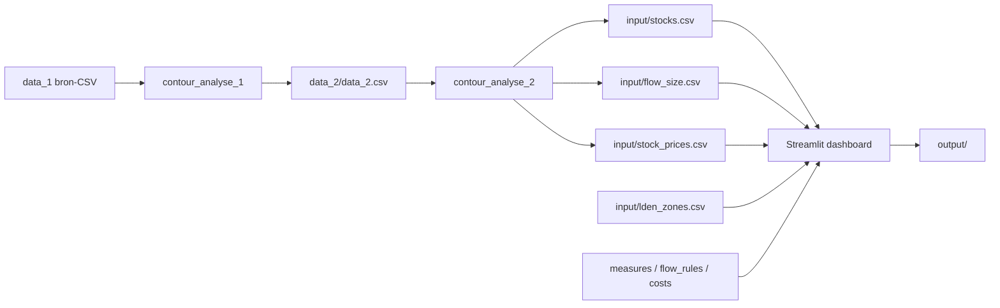

# Data-structuur

Deze pagina beschrijft hoe brondata via analyses naar dashboard-inputs en -outputs stroomt, en **waar** welke grootheden berekend worden.

[← Terug naar README](../readme.md)

---

## Datastroom

| Stap | Script / map | Resultaat |
|------|----------------|-----------|
| Bron | `data_1/` | Sector × Lden-intersecties, transacties, vergunningen, overlap Lnight45/NA70 |
| Analyse 1 | `contour_analyse_1.py` | `data_2/data_2.csv` — één rij per **intersectie** met stocks en gewogen overlay-kolommen |
| Analyse 2 | `contour_analyse_2.py` | Aggregatie per **1 dB-band**; export naar `input/` |
| Dashboard | `app.py` + `models/` + `simulation/` | Simulatie 2026→eindjaar; schrijft `output/` |

De oudere notebooks (`contour_data.py` / marimo) en het package `contour/` bestaan nog als parallel/legacy pad; de **actieve Lden-pipeline** voor dit dashboard is analyse 1 + 2.

---

## Ruimtelijke niveaus

| Niveau | Betekenis |
|--------|-----------|
| **Intersectie** | Overlap van één statistische sector met één 1 dB-Lden-contour (`id_inter_ss_lden`) |
| **1 dB-band** | Alle intersecties met dezelfde `db_lden` (simulatiegranulariteit) |
| **Zone A–F** | 5 dB-bucket (bijv. A = 70–75 dB); mutueel exclusief |
| **Overlay** | Geografische dekking Lnight45 / NA70 als aandeel van de Lden-intersectie |

Zone-mapping: `min dBel ≤ (db_lden + 0.5) < max dBel` via [`input/lden_zones.csv`](../input/lden_zones.csv).

---

## Waar wat berekend wordt

### In `contour_analyse_1.py`

- Join met overlap-CSV → `pct_lnight45`, `pct_na70`, oppervlaktes
- Harmoniseren `inwoners` (Vlaanderen adresniveau / Brussel overlap)
- Stocks: bebouwbare/onbebouwbare percelen, bewoonde (niet-)geïsoleerde woningen, overheidstocks, …
- Gewogen overlay-stocks: `inwoners_lnight45 = inwoners × pct_lnight45 / 100` (idem voor andere stocks)
- Transacties, vergunningen, woongebied-mutaties proportioneel toekennen

### In `contour_analyse_2.py`

- Sommatie van telbare kolommen per `db_lden`
- **Flow rates** per maatregel: teller / noemer → kolommen `*_baseline` / `*_active` in `flow_size.csv`
- **Overlay-shares** per band:

  `share_lnight45 = sum(inwoners_lnight45) / sum(inwoners)`  
  (bij 0 inwoners: fallback op oppervlakte-aandeel)

- Prijzen per band → `stock_prices.csv`
- Intersectie-export → `stocks.csv` (incl. `pct_*` en gewogen inwoners)

### In het dashboard (`models/` + `simulation/`)

- Laden van band-stocks + rates (`lden_data_loader` / `StockManager`)
- Zone-aggregatie voor KPI’s en grafieken
- Jaarlijkse simulatie op **1 dB-band** (niet op zone als ruimtelijke eenheid)
- Afgeleide metrics: ernstig gehinderden, leefbaarheidspunten, kosten

Zie [Dashboard-berekeningen](dashboard-berekeningen.md).

---

## Belangrijkste `input/`-bestanden

| Bestand | Korrel | Rol |
|---------|--------|-----|
| `stocks.csv` | Intersectie | Regionale startstocks (geaggregeerd naar band bij laden) |
| `flow_size.csv` | `db_lden` | Bandtotalen + flow rates + `share_lnight45` / `share_na70` |
| `stock_prices.csv` | `db_lden` | Eenheidsprijzen voor kosten |
| `lden_zones.csv` | Zone | A–F-grenzen + default leefbaarheidspunten |
| `measures.csv` | Maatregel | UI-metadata (`naam_mooi`, `help`, `group_id`, `priority`) |
| `flow_rules.csv` | Regel | Welke stocks, `flow_mode`, default rates (bandrates uit `flow_size` winnen) |
| `measure_costs.csv` | Maatregel | `rel_cost_overheid` / `prive`, `kost_stock` |

Paden staan in [`config.py`](../config.py).

---

## Outputs (`output/`)

| Bestand | Inhoud |
|---------|--------|
| `stock.csv` | Stocks en metrics per `naam` × `jaar` × `zone` |
| `flow_log.csv` | Detail per flow-stap (band/zone) |
| `flow_log_zone.csv` | Geaggregeerd op zone × jaar × flow |

---

## Gerelateerd

- [Overlays Lnight45 / NA70](overlays-lnight45-na70.md)
- [Architectuur](architectuur.md)
- [Terminologie](terminologie.md)
